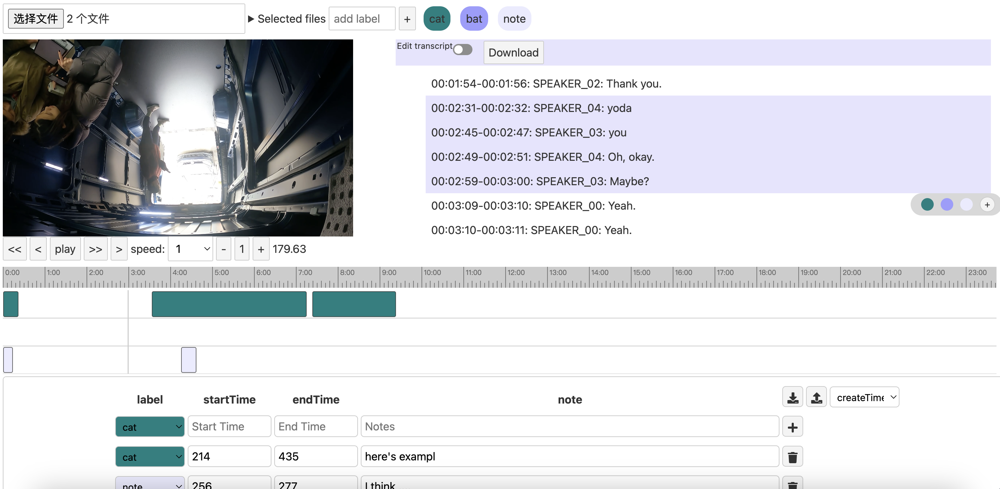

# Annotation Tool for Multimodal Data

⚡ Annotate your multi-model data in a simple web app ⚡

Built with 

- Svelte
- TypeScript & JavaScript
- Electron
- Deployed on Surge

Try it [here](https://annotate.surge.sh/).

## Overview



### Project Background

The challenge of annotating multi-modal data streams, such as videos, images, GPS data, and audios, presents significant difficulties for researchers. Existing tools for analyzing multi-modal data are often limited, particularly for non-technical users. This is especially true when it comes to time-synchronized data streams, an area where current tools frequently fall short. Recognizing these limitations, our project aims to develop a robust, user-friendly web tool that will enable non-technical users to seamlessly annotate these data streams.

### Project Description

Our web tool is designed to provide an all-in-one platform for investigating and labeling sensor data, video, transcripts, and annotations. Users will be able to label videos in a timeline, add customized tags and comments, and download/upload annotation files for further analysis. The project objective is to build a functional tool that incorporates data visualization, streaming data synchronization, multi-modal data synchronization, and an aesthetically pleasing and clear layout of visualizations. To achieve this, we will be using Svelte and Electron to build a cross-platform application.

### Project History

This project was initiated and instructed by Ilan Mandel, a PhD student at Cornell Tech. It began as a special research project for Cornell Tech master's students Chenran Ning (cn257), Ka Wing Lui (kl647), and Jeongmin Huh (jh2229) from February 2021 to December 2021. Currently, the project is being developed by Chenran Ning and Ilan Mandel.


## Get started

### localhost

```bash
npm run dev
```


### With [surge](https://surge.sh/)

Install `surge` if you haven't already:

```bash
npm install -g surge
```

Then, from within your project folder:

```bash
npm run build
surge dist --domain https://annotate.surge.sh/
```


## TODO

- scale to fixed height while rotating

- different color system?
-  showing multiple people's tags
- multiple tag files
- maybe some shades(more users?)
- different users
- sticky videos (the whole row)
- timeline
- video
- play
- hide labels
- data structures in another branch


- [ ] timeline bar is too tall. Seems to act strange when clicking
- [x] bug in timeline when dragging cursor  
- [x] UI for zooming timeline is broken
- [x] load in video files
- [x] select audio
- [x] hide videos
- [ ] keyboard shortcuts
- [ ] selection box spacing is ugly
- [ ] remove `$paused`
- [x] for now always use transcript from video with lower offset
- [ ] fix this nonsense `$: if (files && Object.keys($videoFiles).length === 0) {}`
- [ ] - [ ] Change the main video file in interface
- [ ] change the way we hide videos
- [ ] labels not showing up on transcript
- [ ] scroll right with mouse rather than trackpad
- [ ] zoom is broken
- [ ] labels should be persistent
- [ ] notes should be persistent
- [x] rewind 10 seconds button
- [ ] freezing a lot (on windows not on mac)
- [x] play at multiple speeds
- [ ] main timeline line disappears
- [x] `index.81045a19.js:49 Uncaught (in promise) TypeError: window.showSaveFilePicker is not a function`
- [x] redirect `http` to `https`
